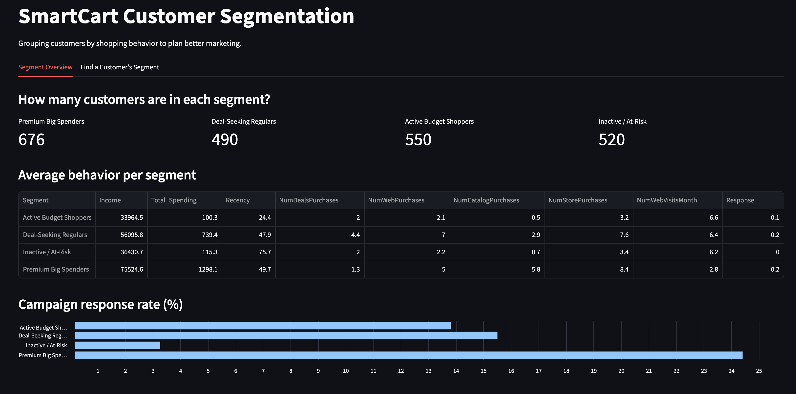
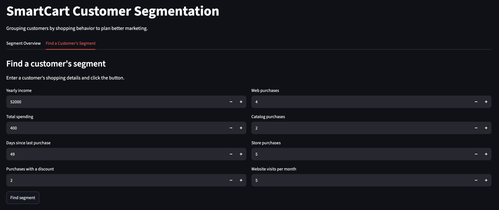

# SmartCart Customer Segmentation

Grouping customers of an online store by **how they shop**, so the store can send the right marketing to the right people.

**Live demo:** [link coming soon]



## Problem

SmartCart sends the same marketing campaigns to every customer. But customers shop very differently, and many campaigns are wasted on people who never respond. The goal is to find groups of similar customers and suggest a different action for each group.

## Approach

1. **Cleaned the data:** filled missing income values, removed impossible ages and an extreme income outlier.
2. **Created features:** age, total spending, total children, customer tenure.
3. **Clustered on shopping behavior only:** income, total spending, recency, and number of deal, web, catalog and store purchases. Demographics (education, living situation) were used only to **describe** the clusters, not to build them.
4. **Chose the number of clusters:** the elbow method suggested 3 and the silhouette score stayed reasonable up to 4. I chose **4**, because the 4th cluster splits low spenders into *active* and *inactive* customers, which need different marketing.
5. **Built a Streamlit app** that shows the segments and predicts the segment for a new customer.

## Customer Segments

| Segment | Customers | Key traits | Campaign response | Suggested action |
|---|---|---|---|---|
| **Premium Big Spenders** | 676 (30%) | Highest income and spending, few children | **24%** | VIP rewards, premium products |
| **Deal-Seeking Regulars** | 490 (22%) | Middle income, use the most deals, shop online | 16% | Discount codes, online sales |
| **Active Budget Shoppers** | 550 (25%) | Low spending, bought recently (~24 days) | 14% | Low-cost bundles, loyalty points |
| **Inactive / At-Risk** | 520 (23%) | Low spending, no purchase in ~76 days | **3%** | Special win-back offer |

## Key Findings

- Premium customers respond to campaigns **8 times more** than inactive customers, so sending the same campaign to everyone wastes money.
- Almost **1 in 4 customers is at risk** of leaving.
- **Recency** is what separates active from inactive low spenders. Without it, the store would treat them the same.
- Living situation is almost the same in every segment, so it does not explain shopping behavior.

## App



- **Segment Overview:** size, average behavior and response rate of each segment
- **Find a Customer's Segment:** enter a customer's details and get their segment and a suggested action

## Limitations

- Data is from one store at one point in time.
- 7 customers have unusual income and purchase values that are likely data errors.
- Campaign response is based on only one past campaign.

## Tech Stack

Python, pandas, scikit-learn (KMeans, StandardScaler), matplotlib, seaborn, Streamlit

## How to Run

```bash
git clone <your-repo-link>
cd smartcart_segmentation
python -m venv venv
source venv/bin/activate
pip install -r requirements.txt
streamlit run app.py
```

## Project Structure

```
├── app.py                  # Streamlit app
├── requirements.txt
├── data/                   # raw data and data with segments
├── models/                 # saved scaler and KMeans model
├── notebooks/              # analysis notebook
└── images/                 # screenshots for this README
```